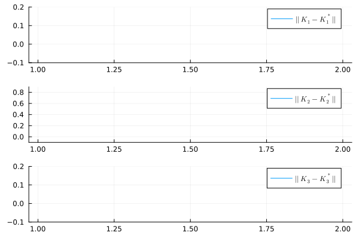
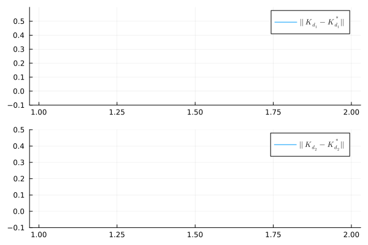
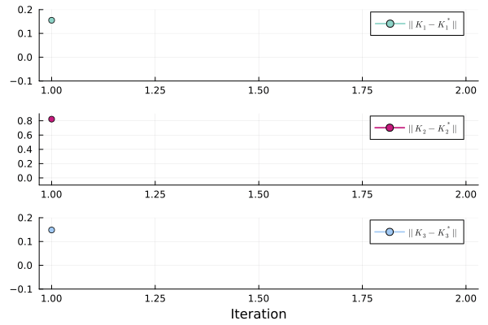
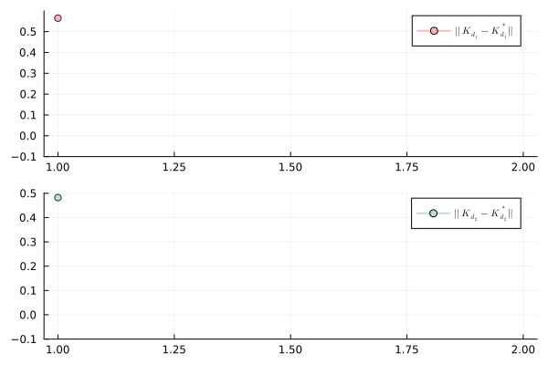

# DataDrivenControl-RL-MultiPlayer

## Introduction
This is my simulation for the On-Policy and Off-Policy Algorithm described in **Output Feedback H_{\infty} Control for Linear
Discrete-Time Multi-Player Systems With Multi-Source Disturbances Using Off-Policy Q-Learning** [paper](https://ieeexplore.ieee.org/document/9261350).

## Experiments:
The corresponding feedback Nash equilibrium
```math
K_1^* =    \begin{bmatrix}
 -0.0295 & 0.0829 & -0.0209
    \end{bmatrix}
;
K_2^* =    \begin{bmatrix}
 0.1904 & 0.1612 & 0.1622
    \end{bmatrix}
;
K_3^* =    \begin{bmatrix}
-0.0253 & 0.0240 & 0.0756
    \end{bmatrix}
```
```math
K_{d1}^* =    \begin{bmatrix}
0.0599& 0.0546 &0.0503
    \end{bmatrix}
;
K_{d2}^* =    \begin{bmatrix}
-0.0183 & -0.0186 & -0.0169
    \end{bmatrix}

```
Using the On-Policy algorithm, I found the following control matrices
```math
K_1^{\infty} =    \begin{bmatrix}
 -0.0295155 & 0.0829427 & -0.0208636
    \end{bmatrix}
;
K_2^{\infty} =    \begin{bmatrix}
 0.190417 & 0.161186 & 0.162189
    \end{bmatrix}
;
K_3^{\infty} =    \begin{bmatrix}
-0.0253269 & 0.023966 & 0.0756409
    \end{bmatrix}
```
```math
K_{d1}^{\infty} =    \begin{bmatrix}
 0.0598972 & 0.0546075 & 0.0502818
    \end{bmatrix}
;
K_{d2}^{\infty} =    \begin{bmatrix}
 -0.0182984 & -0.0186101 & -0.0168696
    \end{bmatrix}

```

Using the Off-Policy algorithm, I found the following control matrices
```math
K_1^{\infty} =    \begin{bmatrix}
  -0.0295155 &  0.0829427 & -0.0208637
    \end{bmatrix}
;
K_2^{\infty} =    \begin{bmatrix}
 0.190417 & 0.161186 & 0.162189
    \end{bmatrix}
;
K_3^{\infty} =    \begin{bmatrix}
 -0.0253269 & 0.023966 & 0.0756409
    \end{bmatrix}
```
```math
K_{d1}^{\infty} =    \begin{bmatrix}
0.0598972 & 0.0546075 & 0.0502818
    \end{bmatrix}
;
K_{d2}^{\infty} =    \begin{bmatrix}
-0.0182984 & -0.0186101 & -0.0168696
    \end{bmatrix}

```

## Comment
The probing noise will not affect the
system and the Nash equilibrium solution learned without
deviation with Off-Policy Algorithm.


## Results
### Results On-Policy Algorithm
| Convergence of the optimal control matrix (On-Policy) | Convergence of the worst disturbance matrix (On-Policy) |
| ------------- | ------------- |
|  |  |

### Results Off-Policy Algorithm
| Convergence of the optimal control matrix (Off-Policy) | Convergence of the worst disturbance matrix (Off-Policy) |
| ------------- | ------------- |
|  |  |

## How to use my code

With my code, you can:

* **On-Policy Algorithm** by running `Solution_OnPolicy_QLearning.jl`
* **Off-Policy Algorithm** by running `Solution_OffPolicy_QLearning.jl`
* **On-Policy Algorithm Result Animation** by running `Animation.jl`
* **Off-Policy Algorithm Result Animation** by running `Animation_OffPolicy.jl`

## Docker
I will provide DockerFile soon.

## Requirements

* **Julia v1.10.3**
* **LinearAlgebra**
* **Plots**
* **Kronecker**
* **LaTeXStrings**
